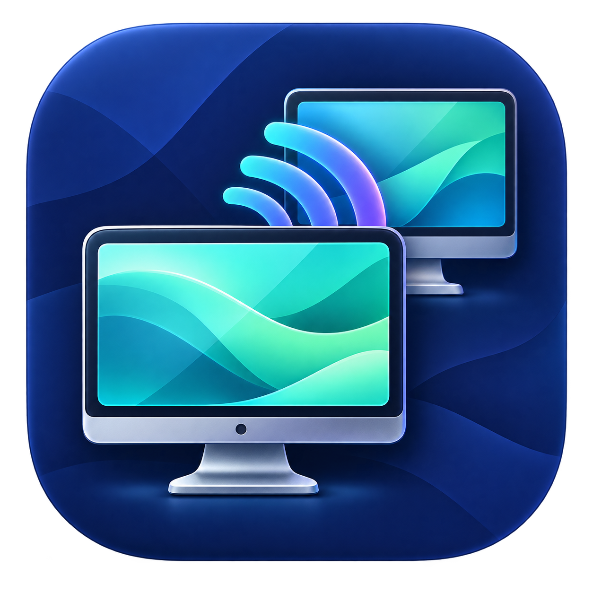

# ScreenTask Mac



**讓 Apple Silicon Mac 在區域網路分享螢幕，觀看者只需瀏覽器。**

以 [EslaMx7/ScreenTask](https://github.com/EslaMx7/ScreenTask) Windows 版為功能參考的獨立 macOS 移植。使用 SwiftUI、ScreenCaptureKit、Network.framework，無第三方套件、無雲端帳號、分享時不需網際網路。

## 下載與使用

1. 到 [Releases](https://github.com/AndyJuang/ScreenTaskMac/releases) 下載 `ScreenTaskMac-0.1.3-arm64.zip`。
2. 解壓縮，將 **ScreenTask Mac.app** 拖到「應用程式」再開啟。**請不要直接從下載資料夾開啟**：macOS 會改以唯讀隔離副本執行（App Translocation），該狀態下曾在 macOS 26.6.2 觸發核心崩潰。若忘了搬移，程式開啟時會主動詢問是否安裝到「應用程式」並重新開啟。適用 **M 系列處理器、macOS 13 Ventura 以上**。
3. 開啟程式；首次使用請在「系統設定 → 隱私權與安全性 → 螢幕錄製」（較新系統稱「螢幕與系統音訊錄製」）允許 ScreenTask Mac，再結束並重新開啟。若出現區域網路或防火牆提示，請允許連入。
4. 選擇螢幕及 Wi-Fi／乙太網路 IP，按「開始分享」。不要選 `127.0.0.1` 給其他裝置使用。
5. 將觀看網址交給同網路的裝置，例如 `http://192.168.1.10:7070/`。分享者按「停止分享」就會關閉服務。

目前發行包為 **ad-hoc 簽署，尚未經 Apple Developer ID 簽署與公證**。下載後若 Gatekeeper 阻擋，請確認來源後，在「系統設定 → 隱私權與安全性」選擇「仍要打開」。不需要關閉整台電腦的安全機制。也可以自行從原始程式碼建置。

若有 Apple Developer ID，建置腳本支援正式簽署與公證：設定 `SCREENTASK_SIGN_IDENTITY`（憑證名稱）與 `SCREENTASK_NOTARY_PROFILE`（`notarytool` 鑰匙圈設定檔）後執行 `bash scripts/build-app.sh`，即會以 hardened runtime 簽署、送交公證並蓋章。

## 功能

- Wi-Fi／乙太網路離線分享，手機、平板與桌面瀏覽器觀看。
- 每位觀看者兩條長連線（`multipart/x-mixed-replace` 串流一條、狀態心跳一條），不再每張畫面開一次連線；瀏覽器不支援串流時自動改用逐張更新。
- 多螢幕選擇（每次分享一個完整螢幕）、滑鼠游標、JPEG 品質與擷取間隔。
- 指定 IPv4 介面與連接埠；預設只接受所選介面同一子網路的來源。
- 私人模式使用 HTTP Basic 帳密驗證，涵蓋觀看頁與所有圖片端點。
- 觀看端暫停／繼續、全螢幕、符合視窗／原始大小、斷線重連；更新間隔在逐張模式才可調整，串流模式由分享端的擷取間隔決定。
- 選單列控制、開啟程式時自動分享／最小化、複製網址、執行紀錄。
- 一般設定保存於 UserDefaults；密碼僅在勾選後，於開始分享時存入 macOS 鑰匙圈。未保存的密碼不寫入磁碟。
- 可同時有多個觀看者，沒有授權人數限制；頻寬與硬體效能仍有限。
- 專屬 macOS 圖示，內含完整 16–1024 px `.icns` 尺寸集，可在 Finder、Dock 與 Spotlight 正確顯示。
- 偵測到程式不是從「應用程式」執行時，可直接複製過去並重新開啟（原本那份會保留）。

完整對照與平台差異見 [功能對照表](docs/FEATURES.md)。本程式分享畫面，不含音訊、遠端操控、AirPlay 或網際網路穿透。

## 網路與隱私

HTTP 畫面與 Basic 帳密**未加密**，適合可信任的區域網路；私人模式不是 TLS。若需跨網路使用，請透過受信任 VPN。預設不開放其他子網路；「允許其他子網路連線」只放寬來源檢查，不會設定路由器、連接埠轉送或防火牆。請勿把服務直接暴露於網際網路。

畫面只留在記憶體，不寫入圖片檔或上傳雲端。串流與輪詢都只送出最新的一張 JPEG，程式本身不替任何觀看者排隊舊畫面；跟不上的觀看者會直接漏掉新畫面，但已交給系統傳送緩衝區的資料仍會留在那裡（實測每條連線約 147 KB）。同一次寫入超過 10 秒沒有進度，就直接重置該連線；名額要等系統真的收掉那條通訊端才釋出，因此停止讀取的裝置無法一直換新連線占位。

HTTP 接收標頭上限 16 KiB、一般連線閒置上限 20 秒（第一個請求 10 秒）、同時上限 256 條連線、單一來源上限 24 條，超量的連線直接中斷、不回應內容。串流連線沒有閒置上限（本來就該一直開著），改以 TCP keepalive 回收已消失的裝置。每位觀看者占兩條連線：串流一條，加上每 3 秒一次極小的 HEAD 心跳一條，用來察覺分享端已停止；因此同一個 IP 最多約 12 位觀看者，整體 256 條大約是 128 位、且要來自多個位址。這是資源保護，並非保證「無限」人數。瀏覽器可能保留已看過的畫面或自行截圖；停止分享無法回收接收者已有的內容。

## 從原始程式碼建置

只需要 Apple Command Line Tools（Swift 5.9 以上），不需要額外套件或完整 Xcode：

```sh
xcode-select --install
git clone https://github.com/AndyJuang/ScreenTaskMac.git
cd ScreenTaskMac
bash scripts/build-app.sh
open "dist/ScreenTask Mac.app"
```

安裝包位於 `dist/`。建置腳本固定產生 arm64，最低部署版本為 macOS 13。其他架構不在本版本支援範圍。

## 測試

```sh
swift run --disable-sandbox ScreenTaskCoreTests
bash scripts/build-app.sh
python3 scripts/smoke-test.py
python3 scripts/viewer-test.py   # 選配：需要 pip install playwright && playwright install
```

回歸測試不依賴 XCTest，因此只有 Command Line Tools 也能執行。HTTP 整合測試啟動真正的 loopback 服務、以人工 JPEG 驗證公開／私人模式、連線重用、多段串流、多請求、HEAD、錯誤路徑及惡意標頭。觀看頁測試（選配）以 Chromium、WebKit、Firefox 三種引擎實際開啟觀看頁，檢查串流播放、暫停／繼續、分享端停止與復原、無法串流時的降級，以及連線數。**兩種測試模式都不擷取螢幕**。真實螢幕授權與跨裝置測試另見 [驗證紀錄](docs/VALIDATION.md)。

## 架構

- `ScreenTaskCore`：HTTP 解析、驗證、固定路由、子網路檢查與 Network.framework listener。
- `ScreenTaskMac`：原生介面、鑰匙圈、網路介面列舉、ScreenCaptureKit 擷取與 JPEG 編碼；`Relocator` 負責偵測 App Translocation 並協助安裝到「應用程式」。
- `Resources/index.html`：所有樣式與程式均內嵌的離線觀看頁。

## 授權與致謝

Copyright © 2026 AndyJuang. 採 **GPL-3.0-or-later**，詳見 [LICENSE](LICENSE)。

功能參考 ScreenTask，感謝原作者 Eslam Hamouda、Wagih ElBedeawi 及社群貢獻者。原始專案 README 聲明 GPL v3 或更新版本。本移植重新撰寫 Swift 與網頁程式，未使用上游 Logo、Bootstrap 或 Windows 程式碼；不代表上游官方 macOS 發行版。參考版本與來源見 [NOTICE](NOTICE)。
